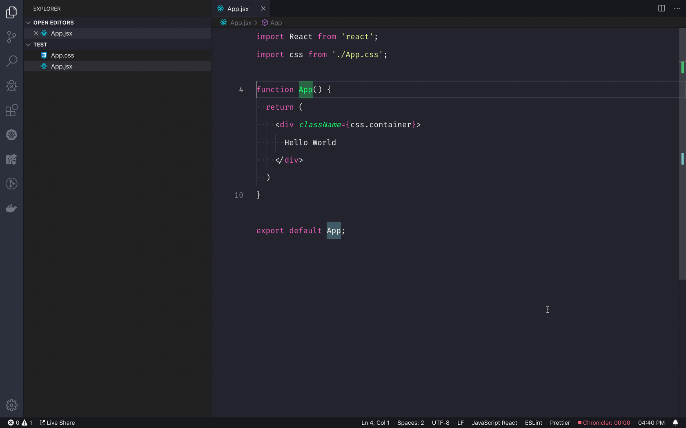

Do you store the styles for your component in a `css`/`styl`/`scss` beside your (React) component? (e.g. `App.css` and `App.styl`)  
Do you constantly switch between the style file and component file?  
This extension is made for you ;)  
Just run `Open Component Or Style` or use key bindings

## Extension Settings

You can add new code (component) and style languages using the following settings:

* `openComponentOrStyle.styleFileLanguages`: language of the style files
* `openComponentOrStyle.codeFileLanguages`: language of the code (component) files
